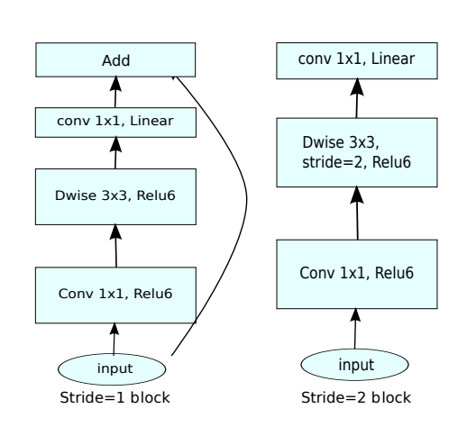
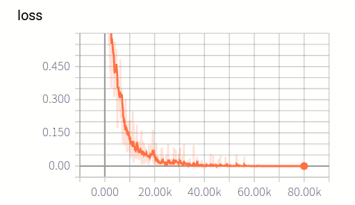

# MobileNet_V2
  - A tensorflow implement for MobileNet_V2 described in [MobileNetV2: Inverted Residuals and Linear Bottlenecks](https://arxiv.org/pdf/1801.04381.pdf). 
  
  - bottleneck residual block
  
  <p align='center'></p>

# Configuration
  - GPU: Geforce GTX 1080Ti
  - ubuntu16.04

# Requirements
  - tensorflow >= 1.0
  - python 2.7.*
  - numpy
  - scipy
  - cPickle
  - Pillow
  
  **Notes**: if you have python with 3.* version, cifar10.py should be replaced by [Hvass-Labs's codes](https://github.com/Hvass-Labs/TensorFlow-Tutorials) and do little adjustments. Any problems, you can email me!!!
  
# Repo Structure
  The following structure show the main frame of this repo.
  
```text
  MobileNet_V2
  |———— data/                                 # store cifar10 dataset
          |———— cifar10/
  |———— main.py                               # repo entry
  |———— MobileNet_V2.py                       # mobilenet class
  |———— utils.py                              # generate datasource
  |———— cifar10.py                            # cifar10.py, cache.py dataset.py  for cifar10 reading
  |———— cache.py
  |———— datatset.py
```

# Usages
## Download Repo
    $ git clone https://github.com/nnuyi/MobileNet_V2.git
    $ cd MobileNet_V2

## Datasets
  In this repo, since the computation, I mainly focus on ***CIFAR10*** datasets.
  
  - **CIFAR10:** You are required to download *CIFAR10* datasets [here](https://www.cs.toronto.edu/~kriz/cifar.html), unzip it and store it in ***'./data/cifar10/'***, note that **CIFAR-10 python version** is required. You can unzip it in ***'./data/cifar10/'*** using the following command:
  
        $ tar -zxvf cifar-10-python.tar.gz
        # you will see that data_batch_* are stored in './data/cifar10/cifar-10-batches-py/'
  
## Training
### [CIFAR10](https://www.cs.toronto.edu/~kriz/cifar.html)

      $ python main.py --batchsize=128 \
                       --is_training=True \
                       --is_testing=False \ 
                       --datasets=cifar10 \
                       --input_height=32 \
                       --input_width=32 \
                       --input_channels=3 \
                       --num_class=10
      
      # If GPU options is avaiable, you can use it as the instruction shows below:
      $ CUDA_VISIBLE_DEVICES=[no] \
        python main.py --batchsize=128 \
                       --is_training=True \
                       --is_testing=False \ 
                       --datasets=cifar10 \
                       --input_height=32 \
                       --input_width=32 \
                       --input_channels=3 \
                       --num_class=10
      
      # notes: [no] is the device number of GPU, you can set it according to you machine
      $ CUDA_VISIBLE_DEVICES=0 \
        python main.py --batchsize=128 \
                       --is_training=True \
                       --is_testing=False \ 
                       --datasets=cifar10 \
                       --input_height=32 \
                       --input_width=32 \
                       --input_channels=3 \
                       --num_class=10

## Results
  - After training, you can see that the testing accuracy rate can reach to about **86.3%**.
  - loss function shows below:
    
    <p align='center'></p>

# TODO
  - Continute to fine-tuning hyperparameters to improve its accuracy!!!
  - Train in cifar100
  - Train in Caltech101

# References
  - [MobileNetV2: Inverted Residuals and Linear Bottlenecks](https://arxiv.org/pdf/1801.04381.pdf)
  - cifar10.py is derived from [Hvass-Labs's codes](https://github.com/Hvass-Labs/TensorFlow-Tutorials)

# Contact
  Email: computerscienceyyz@163.com
